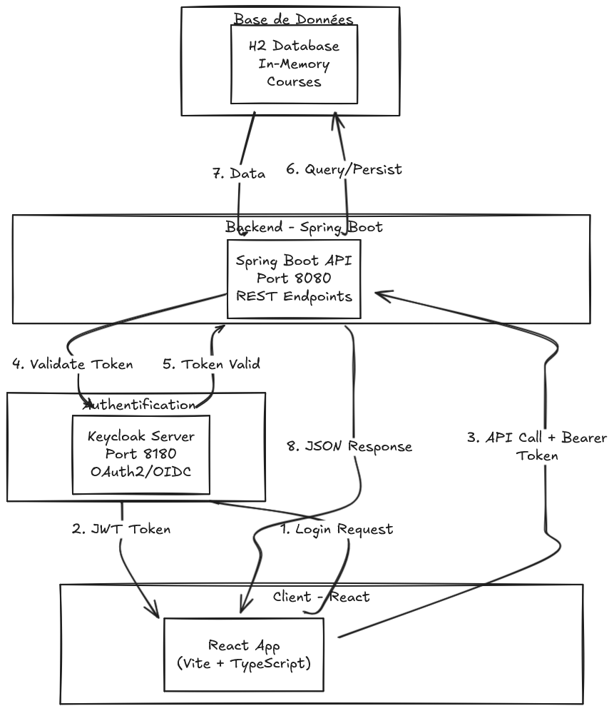
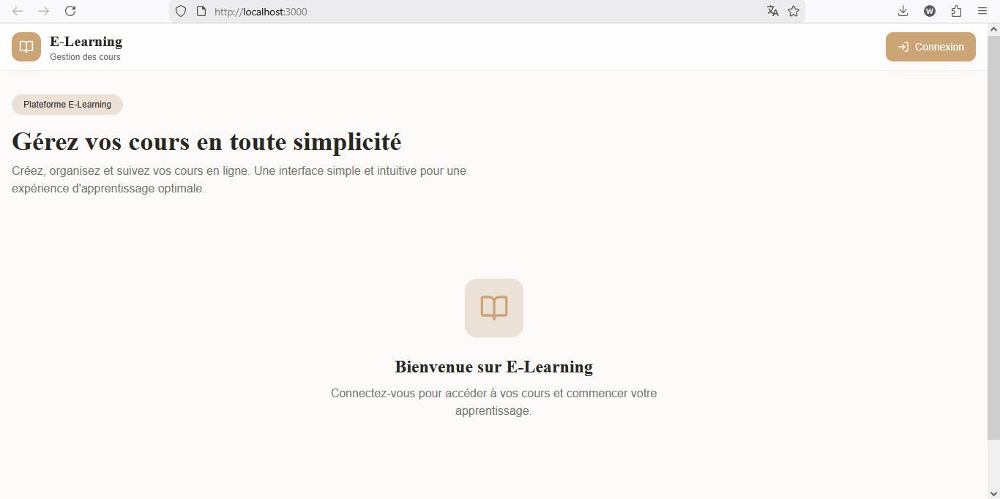
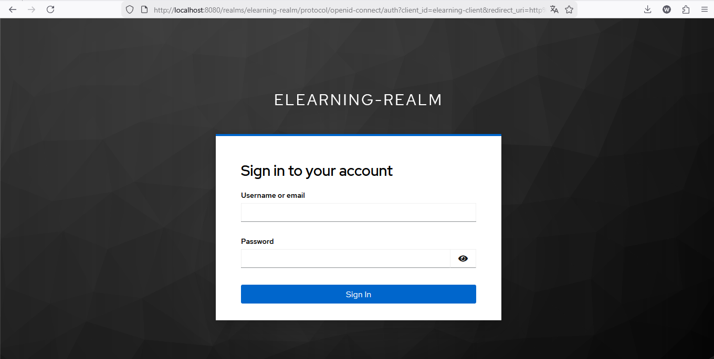
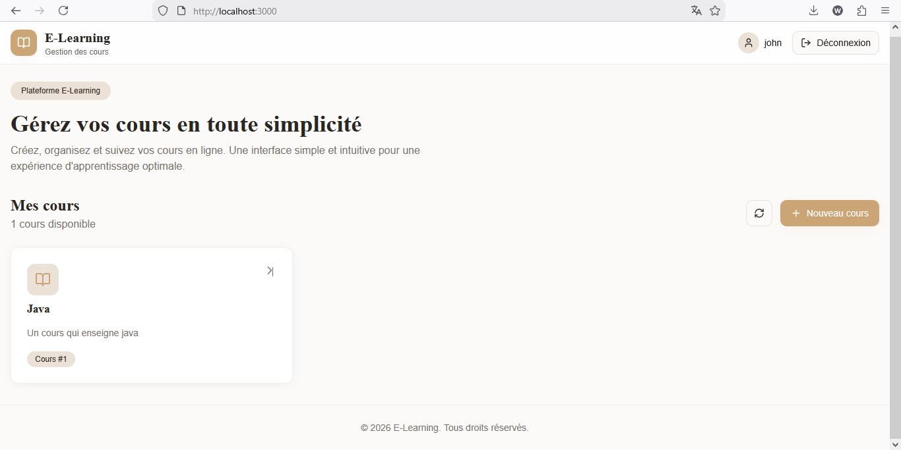
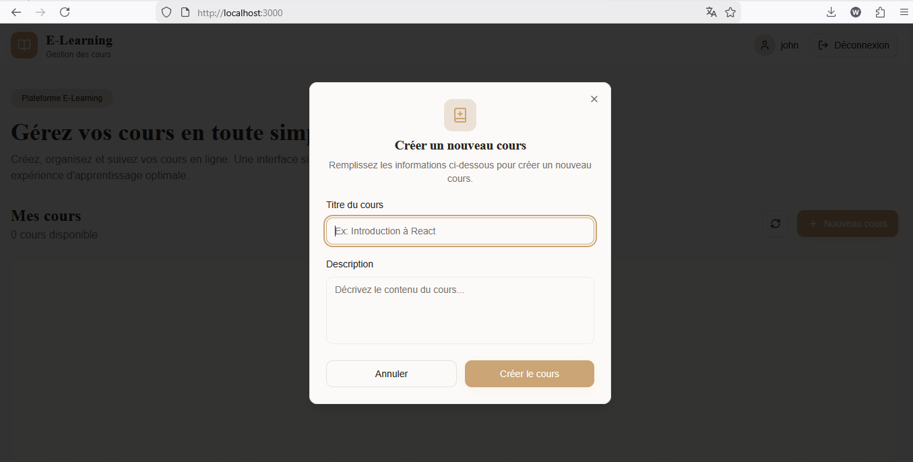

# E-Learning avec Keycloak - Rapport du Projet

##  Table des matières
1. [Vue d'ensemble](#vue-densemble)
2. [Architecture](#architecture)
3. [Fonctionnalités](#fonctionnalités)
4. [Captures d'écran](#captures-décran)
5. [Stack technologique](#stack-technologique)
6. [Installation et configuration](#installation-et-configuration)
7. [Déploiement](#déploiement)

---

##  Vue d'ensemble

**E-Learning Keycloak** est une plateforme d'apprentissage en ligne (e-learning) moderne qui intègre un système d'authentification sécurisé utilisant **Keycloak**, un gestionnaire d'identités et d'accès open-source.

Le projet est une application full-stack composée de :
- **Backend** : Spring Boot 4.0.1 (API REST)
- **Frontend** : React avec Vite et TypeScript
- **Sécurité** : Keycloak pour OAuth2/OIDC
- **Base de données** : H2 Database (développement)

### Objectif
Fournir une plateforme sécurisée permettant aux utilisateurs de :
- S'authentifier via Keycloak
- Consulter et créer des cours
- Gérer leur profil utilisateur
- Accéder à des ressources protégées

---

##  Architecture

### Architecture globale



### Flux d'authentification

```
1. User clique "Login" → Frontend redirige vers Keycloak
2. Keycloak → Authentification (username/password)
3. Keycloak → Retour du token au frontend
4. Frontend → Stockage du token (localStorage/sessionStorage)
5. API → Chaque requête inclut le Bearer token
6. API → Validation du token avec Keycloak
7. API → Retour des données si autorisé
```

---

##  Fonctionnalités

### 1. **Authentification et Sécurité**
-  Intégration Keycloak SSO (Single Sign-On)
-  OAuth2 / OIDC
-  Gestion des rôles et permissions
-  Protection des endpoints API
-  Gestion des tokens JWT

### 2. **Gestion des Cours**
-  Visualisation liste des cours
-  Création de nouveaux cours
-  Affichage des détails du cours
-  Interface responsive et moderne

### 3. **Interface Utilisateur**
-  Design moderne avec TailwindCSS
-  Composants UI (Shadcn/ui)
-  Navigation fluide avec React Router
-  Thème sombre/clair (Next Themes)

---

##  Captures d'écran

### 1. Page d'Accueil
Première impression de la plateforme avec la navigation principale.



### 2. Page d'Authentification
Système de login sécurisé intégré avec Keycloak.



### 3. Page de Gestion des Cours
Liste complète des cours disponibles avec carte pour chaque cours.



### 4. Page de Création de Cours
Formulaire permettant aux utilisateurs de créer de nouveaux cours.



---

##  Stack technologique

### Backend
| Technologie | Version | Utilité |
|---|---|---|
| **Java** | 17 | Langage de programmation |
| **Spring Boot** | 4.0.1 | Framework principal |
| **Spring Security** | - | Authentification OAuth2 |
| **Spring Data JPA** | - | ORM & Persistance |
| **H2 Database** | - | Base de données en-mémoire |
| **Lombok** | - | Réduction du boilerplate |
| **SpringDoc OpenAPI** | 2.7.0 | Documentation API (Swagger) |

### Frontend
| Technologie | Version | Utilité |
|---|---|---|
| **React** | 18.3.1 | Framework UI |
| **TypeScript** | 5.8.3 | Typage statique |
| **Vite** | 5.4.19 | Bundler & Dev Server |
| **React Router** | 6.30.1 | Routage |
| **TailwindCSS** | 3.4.17 | Styles CSS utilitaires |
| **Shadcn/ui** | - | Composants UI réutilisables |
| **Keycloak JS** | 26.2.2 | Client Keycloak |
| **Axios** | 1.13.2 | Client HTTP |
| **React Query** | 5.83.0 | Gestion du cache & sync |
| **React Hook Form** | 7.61.1 | Gestion des formulaires |
| **Zod** | 3.25.76 | Validation de schémas |

### Infrastructure
| Technologie | Utilité |
|---|---|
| **Docker** | Conteneurisation (docker-compose.yaml) |
| **Keycloak** | Gestionnaire d'identités OAuth2/OIDC |
| **Maven** | Build tool |
| **Bun** | Gestionnaire de paquets (alternatif npm) |
| **Vite** | Dev server ultra-rapide |

---

##  Installation et configuration

### Prérequis
- **Java 17+**
- **Node.js 16+** ou **Bun**
- **Maven**
- **Docker & Docker Compose** (pour Keycloak)

### Étapes d'installation

#### 1. Cloner le projet
```bash
git clone <repository-url>
cd e-learning-keycloak
```

#### 2. Démarrer Keycloak
```bash
docker-compose up -d
```
Keycloak sera accessible sur : `http://localhost:8180`

#### 3. Configurer le Backend (Spring Boot)

```bash
# Éditer application.properties si nécessaire
# src/main/resources/application.properties

# Compiler et lancer le serveur
./mvnw clean package
./mvnw spring-boot:run
```

Le backend sera accessible sur : `http://localhost:8080`

#### 4. Configurer le Frontend (React)

```bash
cd client-react

# Installer les dépendances
bun install
# ou
npm install

# Lancer le serveur de développement
bun dev
# ou
npm run dev
```

Le frontend sera accessible sur : `http://localhost:5173`

### Configuration Keycloak

1. Accédez à `http://localhost:8180/admin`
2. Connectez-vous avec les identifiants par défaut
3. Créer un realm "e-learning"
4. Créer un client "e-learning-client"
5. Configurer les redirects URIs :
   - `http://localhost:5173/*`
   - `http://localhost:3000/*`

### Configuration Backend

Éditer `src/main/resources/application.properties` :

```properties
# Keycloak Configuration
spring.security.oauth2.resourceserver.jwt.issuer-uri=http://localhost:8180/realms/e-learning
spring.security.oauth2.resourceserver.jwt.jwk-set-uri=http://localhost:8180/realms/e-learning/protocol/openid-connect/certs

# H2 Database Configuration
spring.h2.console.enabled=true
spring.datasource.url=jdbc:h2:mem:testdb

# JPA Configuration
spring.jpa.database-platform=org.hibernate.dialect.H2Dialect
spring.jpa.hibernate.ddl-auto=create-drop
```

### Configuration Frontend

Créer `client-react/keycloak.config.json` ou utiliser `lib/keycloak.ts` :

```typescript
export const keycloakConfig = {
  url: 'http://localhost:8180',
  realm: 'e-learning',
  clientId: 'e-learning-client'
};
```

---

##  Déploiement

### Avec Docker Compose

Un fichier `docker-compose.yaml` est fourni pour orchestrer l'ensemble :

```yaml
version: '3.8'
services:
  keycloak:
    image: keycloak/keycloak:latest
    environment:
      KEYCLOAK_ADMIN: admin
      KEYCLOAK_ADMIN_PASSWORD: admin
    ports:
      - "8180:8080"

  # Backend inclus dans le compose
  # Frontend peut être containerisé séparément
```

Lancer l'infrastructure :
```bash
docker-compose up -d
```

### Production

Pour un déploiement en production :

1. **Build Frontend** :
   ```bash
   cd client-react
   npm run build
   ```

2. **Build Backend** :
   ```bash
   mvn clean package -DskipTests
   ```

3. **Utiliser une base de données réelle** (PostgreSQL, MySQL)

4. **Configurer un reverse proxy** (Nginx, Apache)

5. **Activer HTTPS/TLS** pour tous les services

6. **Utiliser des secrets managers** pour les variables sensibles

---

##  Structure du projet

```
e-learning-keycloak/
├── backend/
│   ├── src/main/java/org/example/elearningkeycloak/
│   │   ├── controller/        # REST Controllers
│   │   ├── service/           # Business Logic
│   │   ├── entity/            # JPA Entities
│   │   ├── repository/        # Data Access Layer
│   │   └── config/            # Configuration Classes
│   ├── src/main/resources/
│   │   └── application.properties
│   └── pom.xml               # Maven Configuration
│
├── client-react/
│   ├── src/
│   │   ├── components/       # React Components
│   │   ├── pages/           # Page Components
│   │   ├── services/        # API Services
│   │   ├── contexts/        # React Context (Auth)
│   │   ├── hooks/           # Custom Hooks
│   │   ├── lib/             # Utilities
│   │   └── App.tsx
│   ├── package.json
│   └── vite.config.ts
│
├── images/                   # Screenshots
├── docker-compose.yaml       # Docker Orchestration
├── api-docs.json            # OpenAPI Specification
└── README.md                # Ce fichier
```

---

## 🔐 Sécurité

### Principes implémentés

-  **OAuth2/OIDC** via Keycloak
-  **JWT Tokens** avec validation côté serveur
-  **CORS Configuration** pour les requêtes cross-origin
-  **Protection des endpoints** avec @Secured/@PreAuthorize
-  **Gestion des sessions** sécurisées
-  **Validation des entrées** avec Zod (Frontend) et annotations Spring

### Recommandations supplémentaires

- [ ] Implémenter Rate Limiting
- [ ] Ajouter 2FA (Two-Factor Authentication)
- [ ] Logger les événements de sécurité
- [ ] Implémenter une détection des fraudes

---

### Frontend
```bash
cd client-react
npm run test
# ou avec Vitest (à configurer)
```

---

##  Documentation API

Une documentation Swagger/OpenAPI est disponible :

- **Swagger UI** : `http://localhost:8080/swagger-ui.html`
- **OpenAPI JSON** : `http://localhost:8080/v3/api-docs`
- **Fichier statique** : `api-docs.json`

---


